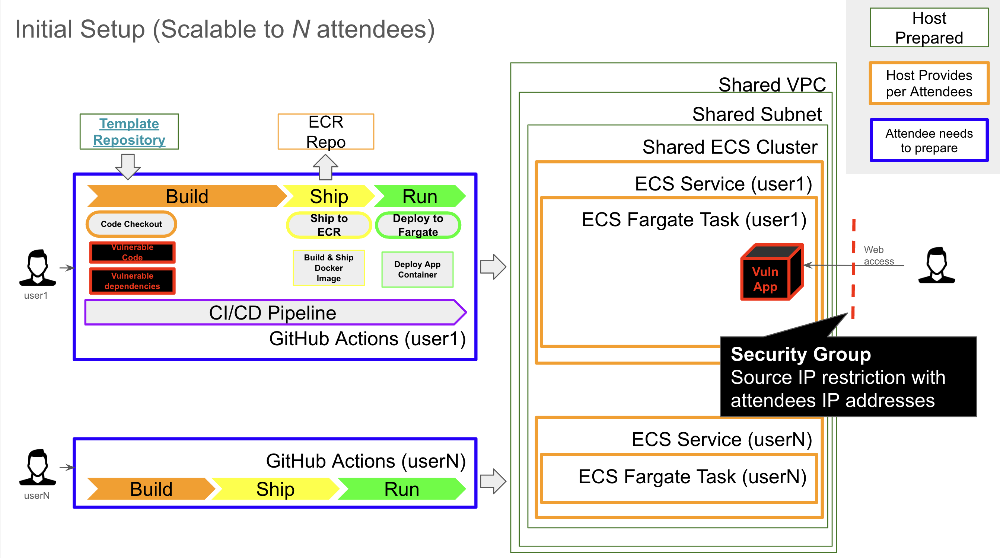
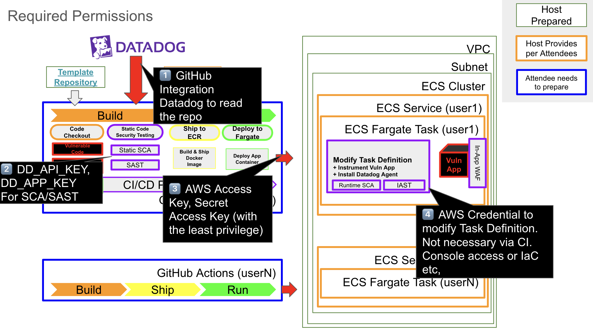

# :sunglasses: Vuln-handson Lab Master Repository

- This repository provide preparation for [Vulnerable Python App For Code Security Workshop](https://github.com/Yosemite8/vulnerable-python-app) includes
- CloudFormation Template
- Shell scripts to create/delete resources per number of hands-on lab attendees.
- JSON file to identify the attendees.

## 🔍️ Lab Setup Overview Image

## 🛠 Repository Structure

```
.
├── CloudFormation/           
│       └── base-vpc.yml             # CFT to create base infrastructure (GREEN box in above diagram)
│       └── fargate-lab.yml          # CFT to create per-attendee resources (run by the script repeatedly, ORANGE box in above diagram)
├── scripts/                         # Shell scripts to create resouces for attendees.
│       ├── attendees.json           # List of attendees (this name is used as resource identifier)
│       ├── create-stack.sh          # script file to create resources as many as the number of attendees in attendees.json
│       └── delete-stack.sh          # script file to delete resources as many as the number of attendees in attendees.json
├── README.md (the file you are reading)
├── img/                             # image files to enrich this README
```

## :key: Required Permissions


## :clapper: Lab Master Preparation
- AWS Account
  - AWS CLI for setup
- AWS Region (your preference)
- Least Privilage IAM User for CI (Recommended) 
  - Provide Access Key ID, Secret Access Key for the attendees.
- Attendee's IP Address List for Source IP restriction (Recommended)
  - Lab Master may want to make attendee's security group secure for unwanted expose.
  - This may be office public IP addresses etc,

## :notebook: Attendee Prerequisites
- Github Account
- AWS Account Access (Lab Master prepared AWS Account)
  - If Lab Master allows attendees AWS console access, provide them accordingly.
- Datadog Account
  - API KEY, APP KEY
- IDE (Recommended)


---
### Disclaimer
This repository is intended solely for educational and demonstration purposes related to application security.
It contains intentionally vulnerable code examples to help learners understand common software weaknesses and how to mitigate them.

Use this code at your own risk.

We do not guarantee the safety, reliability, or suitability of this repository for any production or non-training environment.
By using this material, you agree that the authors and contributors are not responsible for any damage, loss, or legal consequences that may result from misuse or unintended deployment of the contents.

Please ensure you use this repository in a safe, isolated, and authorized environment.